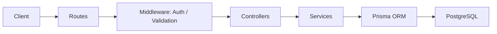
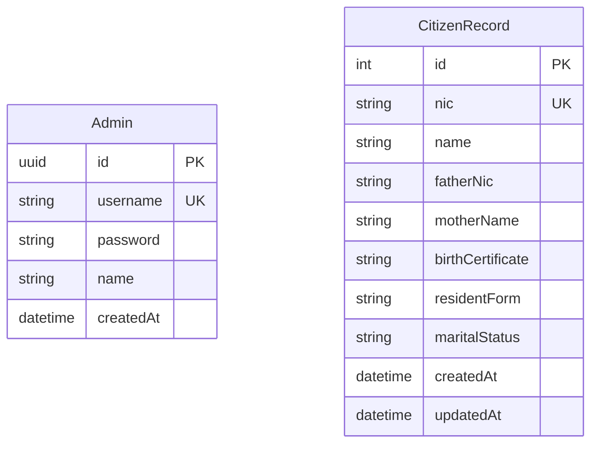
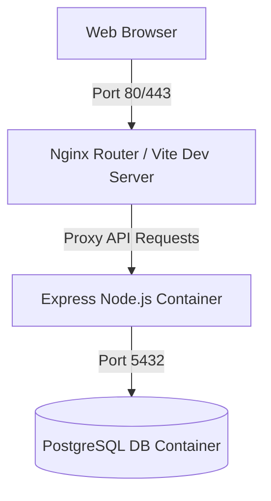

# System Architecture & Design

This document details the target architecture for the modernized NADRA Management System. The legacy C++ console application is replaced with a modern, secure, and containerized Full-Stack Web Application.

---

## 1. Directory Structure

```text
/mcp (Workspace Root)
├── backend/
│   ├── src/
│   │   ├── controllers/      # Route controllers (request handling)
│   │   ├── middleware/       # Auth, error handling, validation middleware
│   │   ├── models/           # Prisma types and schema definitions
│   │   ├── routes/           # Express router files
│   │   ├── services/         # Business logic layer
│   │   ├── utils/            # Logger, JWT utilities
│   │   └── app.ts            # Entrypoint
│   ├── prisma/
│   │   └── schema.prisma     # Prisma schema defining Database models
│   ├── tests/                # Jest integration and unit tests
│   ├── Dockerfile
│   ├── tsconfig.json
│   └── package.json
│
├── frontend/
│   ├── src/
│   │   ├── assets/           # Images, logo assets
│   │   ├── components/       # Reusable UI components (buttons, modal, input, cards)
│   │   ├── context/          # Auth context for login state
│   │   ├── pages/            # View pages (Login, Dashboard, CitizenDetails)
│   │   ├── services/         # API service calls
│   │   ├── App.tsx           # Router and App entry
│   │   └── main.tsx
│   ├── Dockerfile
│   ├── tailwind.config.js
│   ├── postcss.config.js
│   ├── index.html
│   ├── tsconfig.json
│   └── package.json
│
├── scripts/
│   └── migrate-legacy.ts     # Data migration script (txt to postgres)
│
├── docker-compose.yml        # Orchestration (DB, Backend, Frontend)
├── LEGACY_ANALYSIS.md        # Legacy system analysis
├── ARCHITECTURE.md           # System design & architecture (this file)
└── README.md                 # Project guide
```

---

## 2. Backend Architecture

The backend is built using **Node.js**, **TypeScript**, and **Express.js**. It follows a layered architectural pattern separating concerns clearly:



- **Routes**: Defines endpoints, maps them to controllers, and applies middleware.
- **Middleware**:
  - `authMiddleware`: Validates JWT tokens and injects admin context.
  - `validationMiddleware`: Checks request parameters and body structure using schema validators (e.g. Zod).
  - `errorMiddleware`: Captures backend exceptions and sends structured JSON error messages.
- **Controllers**: Parses HTTP request parameters/body, invokes services, and returns HTTP responses.
- **Services**: Contains the core business logic, including validations (e.g. checking age limits or unique NIC numbers) and invokes Prisma ORM.
- **Data Access (Prisma)**: Auto-generated client representing database schema.

---

## 3. Database Design

We use a relational **PostgreSQL** database to ensure transactional integrity, fast searching, and strict constraints.

### Schema Entity Relationship Diagram (ERD)



### Prisma Schema Definitions
```prisma
datasource db {
  provider = "postgresql"
  url      = env("DATABASE_URL")
}

generator client {
  provider = "prisma-client-js"
}

model Admin {
  id        String   @id @default(uuid())
  username  String   @unique
  password  String
  name      String
  createdAt DateTime @default(now())
}

model CitizenRecord {
  id               Int      @id @default(autoincrement())
  nic              String   @unique
  name             String
  fatherNic        String
  motherName       String
  birthCertificate String
  residentForm     String
  maritalStatus    String
  createdAt        DateTime @default(now())
  updatedAt        DateTime @updatedAt
}
```

---

## 4. API Design

All endpoints return JSON and use standard HTTP status codes. Secured endpoints require a Bearer token in the `Authorization` header: `Authorization: Bearer <JWT_TOKEN>`.

### Authentication Endpoints
- `POST /api/auth/register` - Register a new administrator
- `POST /api/auth/login` - Login to receive JWT token
- `GET /api/auth/me` - Get current administrator profile [Secured]

### Citizen Record Endpoints
- `GET /api/records` - List all citizen records with pagination & search filtering [Secured]
- `GET /api/records/:nic` - Get detail of a citizen by NIC number [Secured]
- `POST /api/records` - Create a new citizen record (Verifies age input & NIC uniqueness) [Secured]
- `PUT /api/records/:nic` - Update a specific citizen record by NIC number [Secured]
- `DELETE /api/records/:nic` - Delete a specific record by NIC [Secured]
- `DELETE /api/records` - Bulk delete all records [Secured]

---

## 5. Frontend Architecture

The frontend is a Single Page Application (SPA) built using **React**, **Vite**, and **TypeScript**, styled with **Tailwind CSS**.

### Interface Features:
1. **Authentication Gate**: Only logged-in administrators can access the system. A dashboard landing page displays login statistics.
2. **Dashboard Workspace**:
   - **Global Statistics**: Total registered citizens, breakdown of marital status (married, single, divorced, widowed, etc.), count of valid certificates.
   - **Data Grid**: Displays records in a paginated, searchable grid (searchable by Name, NIC, Father's NIC, and Mother's name).
   - **Interactive Actions**: Modal popups to add new citizen records, modify existing details, or remove citizen files.
3. **Responsive Design**: Mobile-friendly grids that shift to stacked views on smaller devices.

---

## 6. Deployment & Infrastructure



We utilize **Docker Compose** to run three services:
1. **db**: PostgreSQL database container with persistent volume mapping.
2. **backend**: Node.js REST API service connected to database.
3. **frontend**: Vite static build served via standard Node static hosting (or Vite dev server in dev mode).
