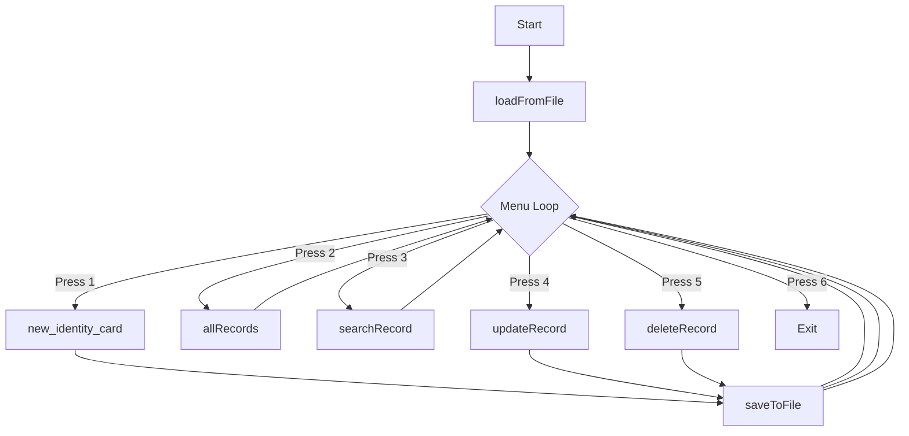

# Legacy C++ Application Analysis

## 1. Executive Summary
The legacy application is a console-based **NADRA (National Database and Registration Authority) Management System** written in C++. It manages citizen records, specifically focusing on National Identity Card (NIC) registration, lookups, updates, and deletion.

Data is stored locally in a plain text file (`nadra_records.txt`) with a hardcoded upper limit of 500 records.

---

## 2. Current Architecture & Application Flow
The application is structured as a monolithic, single-file C++ program (`Nadra-legacy.cpp`) that runs in a terminal environment. 

### Process Flow Diagram


1. **Initialization**: On startup, `main()` calls `loadFromFile()` to load all records from `nadra_records.txt` into memory.
2. **Main Menu**: An infinite loop displays a console menu to the user:
   - **Option 1**: Make a new NIC Card
   - **Option 2**: Show all records
   - **Option 3**: Search a record
   - **Option 4**: Update a record
   - **Option 5**: Delete a record
   - **Option 6**: Exit
3. **Execution & Persistence**: Modifying operations (Create, Update, Delete) write changes back to disk immediately via `saveToFile()`.

---

## 3. Data Storage & Structure
The program uses global, parallel arrays to store fields of records:

```cpp
string name[500];               // Citizen's name
string Father_NIC[500];         // Father's or relative's NIC
string Mother_name[500];        // Mother's name
string Birht_certificate[500];   // Birth certificate or matric certificate ID
string Resident_form[500];      // Resident form number
string NIC_STORE[500];          // Unique NIC number assigned to the citizen
string Maternal_marital[500];   // Marital status (historically stored in Maternal_marital variable)
int total = 0;                  // Total active records count
```

### File Format: `nadra_records.txt`
The data is serialized sequentially:
- **Line 1**: The total number of records (`total`).
- **Following Lines**: Block of 7 lines per record in this exact order:
  1. Name
  2. Father NIC
  3. Mother Name
  4. Birth Certificate
  5. Resident Form Number
  6. Marital Status
  7. NIC Number

#### Example Block:
```text
500
Hamza
553320948
Owais Baig
BC-24954016
98076
married
1601511
...
```

---

## 4. Modules & Business Rules

### Business Rules
1. **Age Verification**: 
   - A user-specified batch of applicants is checked for age.
   - The age must be **18 or older** to apply for an NIC card.
   - *Bug/Limitation*: The age is requested as a block validator rather than stored per-person. If the batch age is entered as < 18, the entire batch entry is rejected.
2. **Buffer Overflow Risk**:
   - The arrays are hard-limited to size `500`.
   - If `total` exceeds 500, writing/reading to these arrays causes out-of-bounds memory access (undefined behavior, crashes, or security vulnerabilities). Currently, `nadra_records.txt` contains exactly 500 records, meaning the application is at absolute capacity.
3. **Identifier Uniqueness**:
   - The system searches, updates, and deletes records based on the citizen's NIC number (`NIC_STORE`).
   - Duplicate NICs are not explicitly blocked by C++ code on input, but updates/deletions only target the first match found.
4. **Input Constraints**:
   - Reading variables using `cin >> ...` means that spaces are not permitted during console inputs (it would cause word splitting and break subsequent inputs). However, files are read using `getline`, which does allow spaces.

---

## 5. Modernization Risks & Mitigation Plan

| Risk | Impact | Mitigation Strategy |
| :--- | :--- | :--- |
| **Array Out of Bounds** | High (Crash/Data Loss) | Replace fixed arrays with PostgreSQL dynamic storage. |
| **Console Space-split Input** | Medium (Malformed input) | Use HTML form input with proper string validation. |
| **Data Types & Inconsistencies**| Medium (Migration failures) | Parse all fields from text file into structured SQL types. Handle empty/dirty strings gracefully in the migration script. |
| **Security & Auditing** | High (No Auth in C++) | Implement JWT Authentication for administrative roles. Hash passwords and secure all endpoints. |
| **Concurrent Access** | High (File locking issues) | PostgreSQL manages concurrent transactions safely, removing C++ file writing race conditions. |
